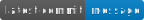

[](https://app.netlify.com/sites/learnic/deploys)


## To running localy

 - Install [Docker](https://www.docker.com/get-started)

- Clone the repo

    ```sh
    $ git clone https://github.com/delawere/memorize_words.git
    $ cd memorize_words
    ```

- Run

    ```sh
    $ docker-compose up
    ```
